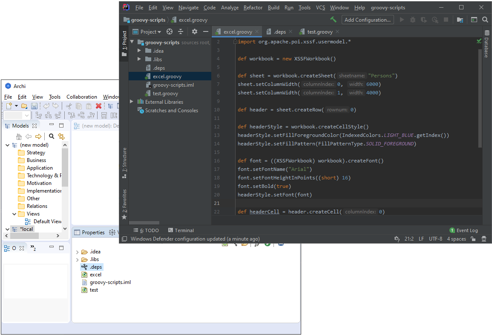
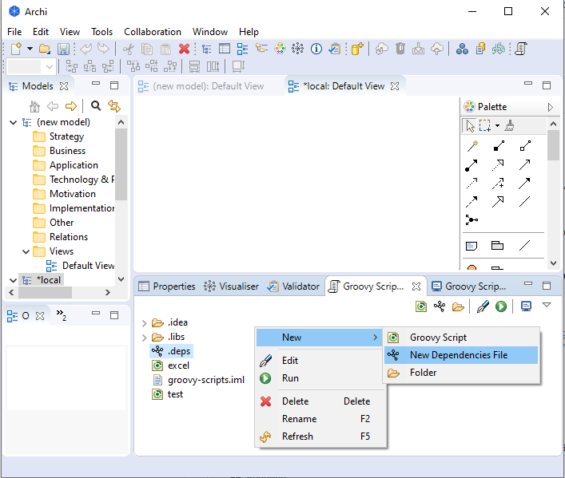

# Archi Groovy Scripting Plug-in

## What is this?

__Notice__ : This plugin is a free adaptation of the very good [jArchi](https://github.com/archimatetool/archi-scripting-plugin) module and provide the same functionality and more with Groovy Scripting. Tanks a lot to the authors of this module and their advices.

__Version 1.0.0__

This is an extension to Archi that allows scripting using the Groovy language. The Archi Groovy scripting API has access to the components of an Archi model so that you can construct your own tasks and queries to achieve things that you might not be able to do easily via the user interface. For example you could write an Archi Groovy script to:

    Generate reports
    Create heat maps
    Import and export to and from different formats
    Query models
    Quickly replace or merge concepts
    Find and remove redundant elements
    Batch processing

Archi Groovy help you to manage JARs dependency for your script. All the Java ecosystem is on your hands. See the dependency section to know more.

You can use your favorite IDE to edit and control version for your script. Archi Groovy Scripting was successfully tested with Eclispe and IntelliJ IDEA.

Archi Groovy users can share their scripts and learn from each other, see here for some shared scripts.



## How to use it

Download the plugin here : [https://github.com/grrolland/archi-groovy-scripting-plugin-binary/raw/master/com.archimatetool.groovyscripts-1.0.0.archiplugin](https://github.com/grrolland/archi-groovy-scripting-plugin-binary/raw/master/com.archimatetool.groovyscripts-1.0.0.archiplugin)

Use the menu Help->Manage Plugins in Archi to install it.

## Exemples

Some groovy script examples for Archi are located here : [Examples](examples)

## Dependencies Management

You can create a dependencies management directly from the Groovy Scripting view : 



This file is created with an example content :
 
```
#
# Dependencies File
# 
# Dependency format : Maven GAV
#
# groupId:artifactId:version
#
org.apache.poi:poi:4.1.1 # For excel export
```

Each line in this file represents a top level dependency for your scripts. The format of the line is like the Groovy DSL for dependencies :

```
groupId:artifactId:version
```

When you execute a script, all the transitive dependencies are downloaded in the __.lib__ folder and each library downloaded is added to the runtime classpath of your script.

## Roadmap
The roadmap is shared with you helped by the __Issues__ section of the project. Be free to create __Feature Issue__ and we could discuss about it and add it to the roadmap. 

## Contributing code to Archi Groovy Scripting Plug-in
First, create an issue, feature or not. 

After that, you can fork the project, add your code and create a pull request attached to your issue.

The pull request will be discussed and when and when everyone agrees, the request will be merged.  

## Archi
Archi® is a free, open source, cross-platform tool and editor to create ArchiMate models.

The Archi® modelling tool is targeted toward all levels of Enterprise Architects and Modellers. It provides a low cost to entry solution to users who may be making their first steps in the ArchiMate modelling language, or who are looking for a free, cross-platform ArchiMate modelling tool for their company or institution and wish to engage with the language within a TOGAF® or other Enterprise Architecture framework.

ArchiMate® is an open and independent Enterprise Architecture modelling language that supports the description, analysis and visualization of architecture within and across business domains. ArchiMate is one of the open standards hosted by The Open Group and is fully aligned with TOGAF®.

The Archi website is here: [https://www.archimatetool.com](https://www.archimatetool.com)
